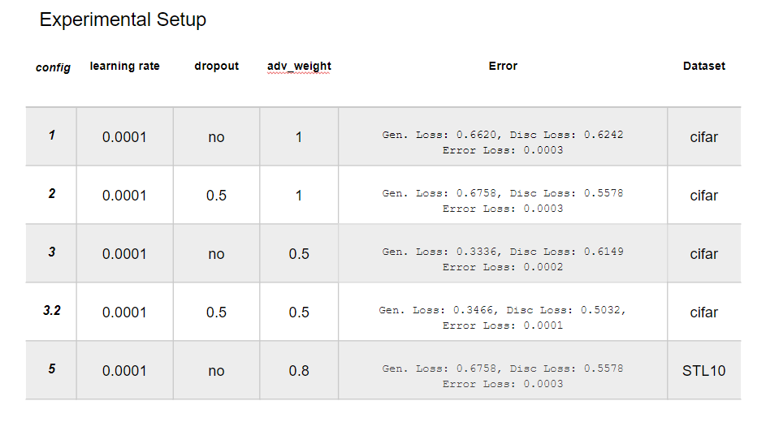
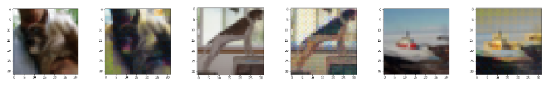

# Colorization-DeepLearning

## Content
In this repository there are 2 .ipynb files. 
For different dataset used
* CIFAR10: colorization.ipynb
* STL10: colorizationSTL.ipynb

## Test
Go to the last section (test) and change the file name taking into account the configuration table.

### Models
* gan1.ckpt - CIFAR10
* gan2.ckpt	- CIFAR10
* gan3.ckpt - CIFAR10
* gan3_2.ckpt - CIFAR10
* gan_color5_dataset.ckpt - STL10

### Some results
